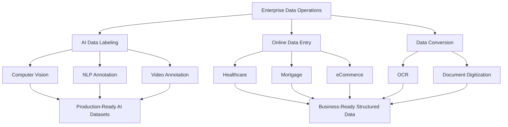
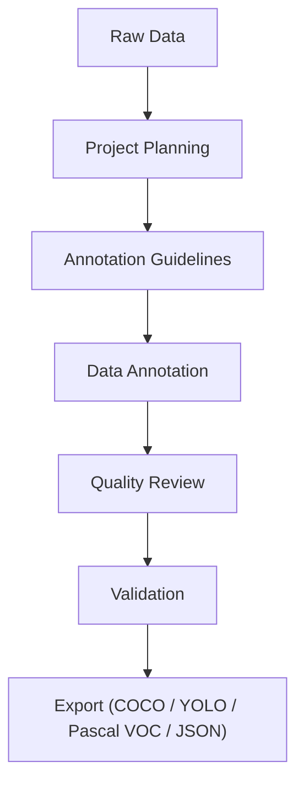
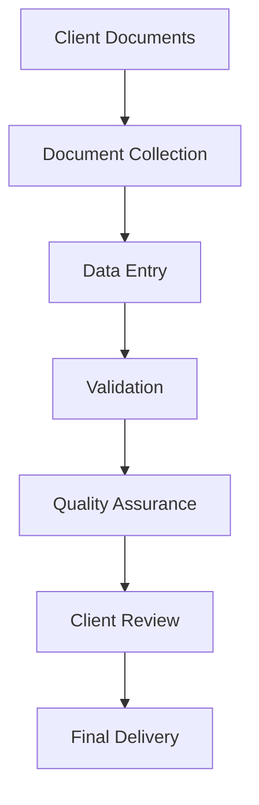
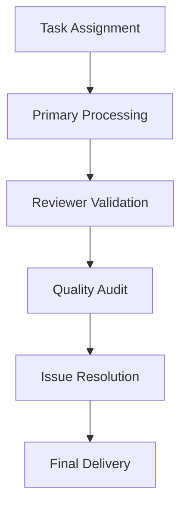

# Enterprise Data Labeling & Data Entry Services

[](https://img.shields.io/badge/Documentation-Enterprise-blue) [](https://img.shields.io/badge/AI-Data%20Labeling-green) [](https://img.shields.io/badge/BPO-Data%20Entry-orange) [](https://img.shields.io/badge/License-Apache%202.0-red) [](https://img.shields.io/badge/Maintained-Yes-brightgreen)

Enterprise documentation and technical resources covering AI data labeling, computer vision annotation, online data entry, document digitization, data conversion, and scalable enterprise data operations.

This repository provides educational documentation for enterprise AI data preparation, document processing, and scalable business process operations.

---

## Repository Contents

This repository contains documentation only — there is no source code, dataset, or installable software here. It consists of a single `README.md` that covers:

- Enterprise workflow diagrams for data labeling, data entry, and data conversion
- Reference documentation on annotation types, data entry categories, and document digitization services
- An industry-support reference table
- Quality assurance and security/compliance frameworks
- Links to Precise BPO Solution's official website and related documentation repositories

If you are looking for open-source tooling or a codebase, this is not that — it is a structured reference for enterprise data operations practices.

### Who This Repository Is For

This documentation is intended for AI engineers evaluating training data pipelines, data teams responsible for annotation and entry quality, researchers studying enterprise data operations, operations managers overseeing outsourced data workflows, and enterprise organisations assessing data labeling, data entry, and document processing practices.

### Repository Structure

```
README.md
 └── Enterprise documentation
     ├── AI Data Labeling
     ├── Online Data Entry
     ├── Data Conversion
     ├── Industry References
     ├── Quality Assurance
     ├── Security & Compliance
     └── External Resources
```

---

## Enterprise Data Operations Workflow



---

## About This Repository

This repository provides educational documentation and enterprise best practices covering modern data operations for Artificial Intelligence, Machine Learning, Digital Transformation, Healthcare, Finance, Retail, Manufacturing, Logistics, and Business Process Outsourcing.

Topics include:

- AI Data Labeling & Annotation
- Computer Vision Annotation
- Natural Language Processing Annotation
- Online Data Entry Services
- Document Processing
- Data Conversion
- OCR Verification
- Healthcare Data Processing
- Mortgage Document Processing
- Retail Product Data Management
- Quality Assurance Frameworks
- Secure Enterprise Data Operations

The objective is to share structured implementation approaches, workflows, quality practices, and operational standards commonly used in enterprise-scale data projects.

> **Maintained by Precise BPO Solution**

---

## Why This Repository

This repository serves as a technical knowledge base for organizations exploring enterprise data operations. It complements the official website by providing educational documentation, workflow examples, implementation guidance, and best practices for scalable data processing.

---

## Table of Contents

- [Repository Contents](#repository-contents)
- [Enterprise Data Operations Workflow](#enterprise-data-operations-workflow)
- [About This Repository](#about-this-repository)
- [Why This Repository](#why-this-repository)
- [Data Labeling & Annotation](#data-labeling--annotation)
- [Online Data Entry Services](#online-data-entry-services)
- [Data Conversion & Document Digitization](#data-conversion--document-digitization)
- [Industries We Support](#industries-we-support)
- [Quality Assurance Framework](#quality-assurance-framework)
- [Security & Compliance](#security--compliance)
- [Why Precise BPO Solution](#why-precise-bpo-solution)
- [Enterprise Resources](#enterprise-resources)
- [Official Website](#official-website)
- [Related GitHub Repositories](#related-github-repositories)
- [Disclaimer](#disclaimer)
- [Maintained by Precise BPO Solution](#maintained-by-precise-bpo-solution)
- [Repository Highlights](#repository-highlights)

---

## Data Labeling & Annotation

High-quality data labeling is the foundation of reliable Artificial Intelligence (AI) and Machine Learning (ML) systems. Accurate annotations enable computer vision, natural language processing, autonomous systems, healthcare AI, retail AI, manufacturing automation, intelligent document processing, and predictive analytics.

### Core Annotation Services

**Computer Vision Annotation**

- Bounding Box Annotation
- Polygon Annotation
- Polyline Annotation
- Landmark & Keypoint Annotation
- Semantic Segmentation
- Instance Segmentation
- Cuboid (3D) Annotation
- Image Classification

**Natural Language Processing (NLP)**

- Named Entity Recognition (NER)
- Text Classification
- Sentiment Annotation
- Intent Classification
- Document Annotation

**Video Annotation**

- Multi-Object Tracking
- Object Tracking
- Frame-by-Frame Annotation
- Pose Estimation
- Action Recognition

### Enterprise Annotation Workflow



### Typical Deliverables

- COCO JSON
- YOLO
- Pascal VOC XML
- CSV
- JSON
- XML
- Custom Client Formats

Enterprise annotation projects are supported through documented workflows, quality assurance checkpoints, and structured review processes to deliver consistent, production-ready datasets for AI model development.

---

## Online Data Entry Services

Enterprise organizations depend on accurate, scalable, and secure data entry operations to improve operational efficiency, maintain data integrity, and support digital transformation initiatives.

### Core Data Entry Services

**Business Data Processing**

- Online Data Entry
- Offline Data Entry
- CRM Data Entry
- ERP Data Entry
- Spreadsheet Data Entry
- Database Updating

**Document Processing**

- Invoice Data Entry
- Purchase Order Processing
- Receipt Processing
- Survey Data Entry
- Registration Forms
- Application Forms
- Business Card Data Entry
- Driver Logs
- Airway Bills

**Industry-Specific Data Entry**

- Healthcare Data Entry
- Medical Claims Processing
- Mortgage Data Entry
- Financial Data Entry
- Insurance Data Processing
- Product Catalog Data Entry
- eCommerce Product Information Management

### Enterprise Data Entry Workflow



### Output Formats

- Microsoft Excel
- CSV
- XML
- JSON
- SQL Database
- Client-Specific Formats

Structured quality checks, validation procedures, and documented workflows help ensure high levels of accuracy, consistency, confidentiality, and timely project delivery.

---

## Data Conversion & Document Digitization

Modern organizations frequently convert legacy paper records and unstructured digital documents into searchable, structured, and business-ready digital assets.

### Services Include

- PDF to Excel
- PDF to Word
- Image to Text
- OCR Verification
- XML Conversion
- JSON Conversion
- HTML Conversion
- Document Digitization
- Archive Digitization
- Records Management

### Typical Use Cases

- Healthcare Records
- Financial Documents
- Legal Documents
- Engineering Records
- Insurance Forms
- Product Catalogs
- Historical Archives
- Government Records

Enterprise data conversion improves accessibility, searchability, reporting, compliance, and operational efficiency while supporting long-term digital transformation strategies.

---

## Industries We Support

Enterprise data operations support organizations across multiple industries requiring accurate, secure, and scalable information processing.

| Industry                   | Typical Services                                            |
| --------------------------- | ------------------------------------------------------------ |
| Artificial Intelligence    | Data Labeling, AI Training Data, Annotation                 |
| Healthcare                 | Medical Data Entry, Claims Processing, Medical Annotation   |
| Banking & Finance          | Financial Data Entry, Mortgage Processing                   |
| Insurance                  | Claims Data Processing, Document Verification                |
| Retail & eCommerce         | Product Catalog Management, Product Annotation              |
| Manufacturing              | Quality Inspection Annotation, Engineering Data Processing  |
| Logistics & Transportation | Shipment Documentation, Driver Logs, Airway Bills           |
| Automotive                 | Vehicle Annotation, Autonomous Driving Datasets              |
| Agriculture                | Crop Annotation, Agricultural AI Datasets                    |
| Government                 | Records Digitization, Archive Conversion                    |
| Legal                      | Legal Document Processing                                    |
| Education                  | Student Records, Examination Data Processing                 |

Organizations across these industries rely on structured data operations to improve operational efficiency, regulatory compliance, reporting accuracy, and AI model performance.

---

## Quality Assurance Framework

Consistent quality management is fundamental to enterprise-scale data operations. Every project benefits from documented workflows, standardized review procedures, and continuous validation.

### Quality Principles

- Documented project guidelines
- Multi-level quality review
- Reviewer validation
- Random sampling
- Exception reporting
- Continuous feedback
- Version control
- Final quality audit

### Enterprise Quality Workflow



A structured quality assurance framework helps reduce processing errors while maintaining consistency across large-scale enterprise projects.

---

## Security & Compliance

Enterprise data operations require secure handling procedures throughout the project lifecycle to protect confidential business information.

### Security Practices

- Confidential handling of client information
- Role-based access controls
- Secure file transfer workflows
- Non-Disclosure Agreement (NDA) support
- Controlled project access
- Data minimization principles
- Audit-ready documentation

### Compliance Frameworks

- ISO 27001-Aligned Processes
- GDPR-Compliant Workflows
- HIPAA-Ready Processes

Security and compliance considerations are incorporated into data labeling, online data entry, document processing, and enterprise information management workflows.

---

## Why Precise BPO Solution

Precise BPO Solution provides enterprise data services designed to support organizations requiring reliable, scalable, and quality-focused data operations.

### Core Service Areas

The core service areas — AI data labeling and annotation, computer vision annotation, online data entry, data conversion, document digitization, product data management, healthcare data processing, and mortgage document processing — are documented in detail in the [Data Labeling & Annotation](#data-labeling--annotation), [Online Data Entry Services](#online-data-entry-services), and [Data Conversion & Document Digitization](#data-conversion--document-digitization) sections above.

### Key Strengths

- 17+ years of operational experience
- Enterprise-focused workflows
- Multi-industry expertise
- Structured quality assurance
- Secure project execution
- Flexible engagement models
- Production-ready deliverables
- Experienced project management

Our documentation reflects enterprise practices that support AI development, business process outsourcing, digital transformation, and large-scale information management projects across multiple industries.

---

## Enterprise Resources

This repository is part of a growing collection of enterprise documentation focused on data operations, AI data preparation, document processing, and business process outsourcing.

### Documentation Topics

The topics above — AI data labeling, online data entry, data conversion, and the supporting QA and security frameworks — form the core subject matter of this collection. Related repositories (linked below) extend this documentation with additional detail on OCR verification, mortgage and healthcare processing, and product data management.

These resources are intended to provide educational guidance and implementation references for enterprise organizations, AI teams, researchers, and business professionals.

---

## Official Website

Explore our enterprise services and technical resources.

### Company

- 🌐 [Homepage](https://www.precisebposolution.com/)
- 👥 [About Precise BPO Solution](https://www.precisebposolution.com/about-us.html)
- 📩 [Contact Us](https://www.precisebposolution.com/contact-us.html)

### Enterprise Data Labeling Services

- [Data Labeling Services](https://www.precisebposolution.com/data-labeling-services.html)
- [Bounding Box Annotation](https://www.precisebposolution.com/bounding-box.html)
- [Polygon Annotation](https://www.precisebposolution.com/polygon.html)
- [Semantic Segmentation](https://www.precisebposolution.com/semantic-segmentation.html)
- [Cuboid Annotation](https://www.precisebposolution.com/cuboid.html)
- [Landmark Annotation](https://www.precisebposolution.com/landmark-annotation.html)
- [Text Annotation](https://www.precisebposolution.com/text-annotation.html)
- [Medical Annotation](https://www.precisebposolution.com/medical-annotation.html)
- [Retail Annotation](https://www.precisebposolution.com/retail-annotation.html)

### Enterprise Data Entry Services

- [Online Data Entry Services](https://www.precisebposolution.com/online-data-entry.html)
- [Product Data Entry](https://www.precisebposolution.com/product-data-entry.html)
- [Financial Data Entry](https://www.precisebposolution.com/financial-data-entry.html)
- [Mortgage Data Entry](https://www.precisebposolution.com/mortgage-data-entry.html)
- [Medical Claim Processing](https://www.precisebposolution.com/medical-claim.html)
- [Data Conversion Services](https://www.precisebposolution.com/data-conversion.html)

### Knowledge Centre

- [Blog](https://www.precisebposolution.com/blog/)

---

## Related GitHub Repositories

This repository complements additional enterprise documentation available within the Precise BPO Solution GitHub profile.

- [Enterprise Data Operations Resources](https://github.com/nanhegujral/enterprise-data-operations-resources)
- [AI Data Annotation Services](https://github.com/nanhegujral/ai-data-annotation-services)
- [Precise Online Data Entry Services](https://github.com/nanhegujral/precise-online-data-entry-services)

Together, these repositories provide educational documentation covering:

- Enterprise AI Data Labeling
- Computer Vision Annotation
- Online Data Entry
- Document Processing
- OCR Verification
- Healthcare Data Processing
- Mortgage Document Processing
- Product Data Management
- Data Conversion
- Enterprise Quality Assurance
- Scalable Business Process Operations

---

## Disclaimer

The information provided in this repository is intended for educational and informational purposes only. Workflows, methodologies, examples, and documentation may be adapted to meet individual client requirements, project specifications, regulatory obligations, and industry best practices.

---

## Maintained by Precise BPO Solution

Enterprise Data Labeling • AI Annotation • Online Data Entry • Data Conversion • Document Digitization

For additional information, please visit:

**[www.precisebposolution.com](https://www.precisebposolution.com/)**

---

## Repository Highlights

This repository brings together enterprise documentation, workflow diagrams, and reference material for AI data labeling, online data entry, document digitization, data conversion, and the quality assurance and compliance practices that support them.


© Precise BPO Solution. All rights reserved.
